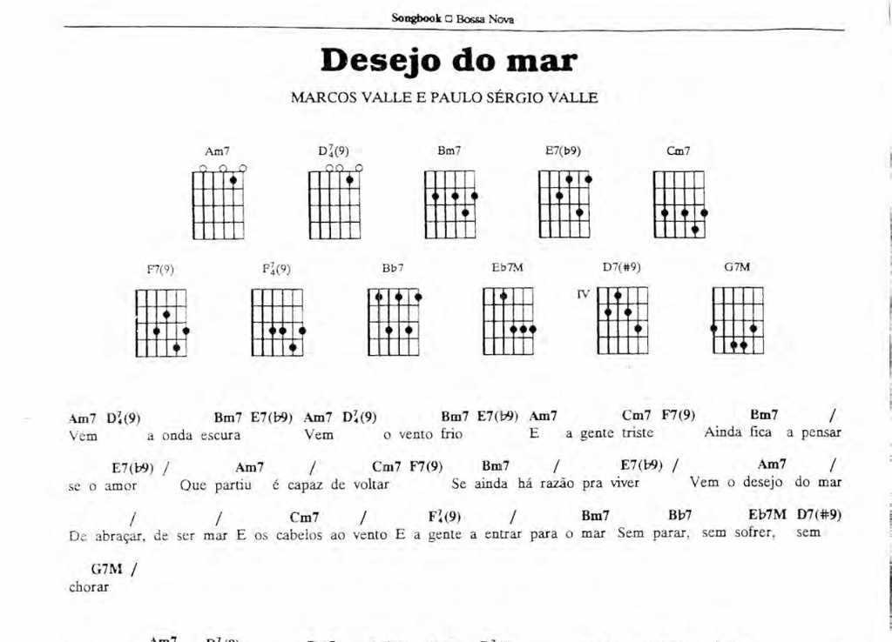
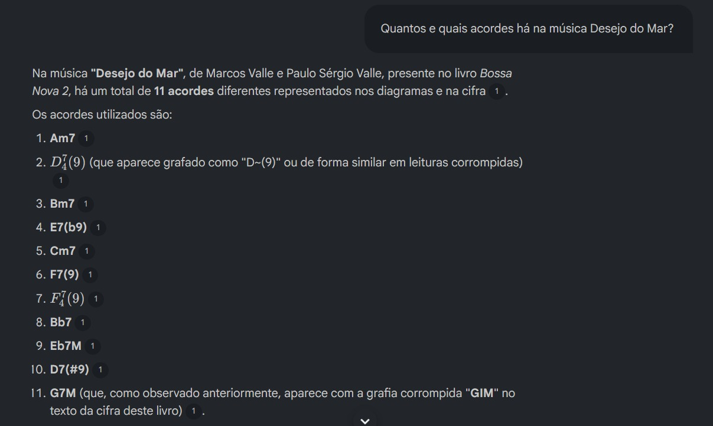
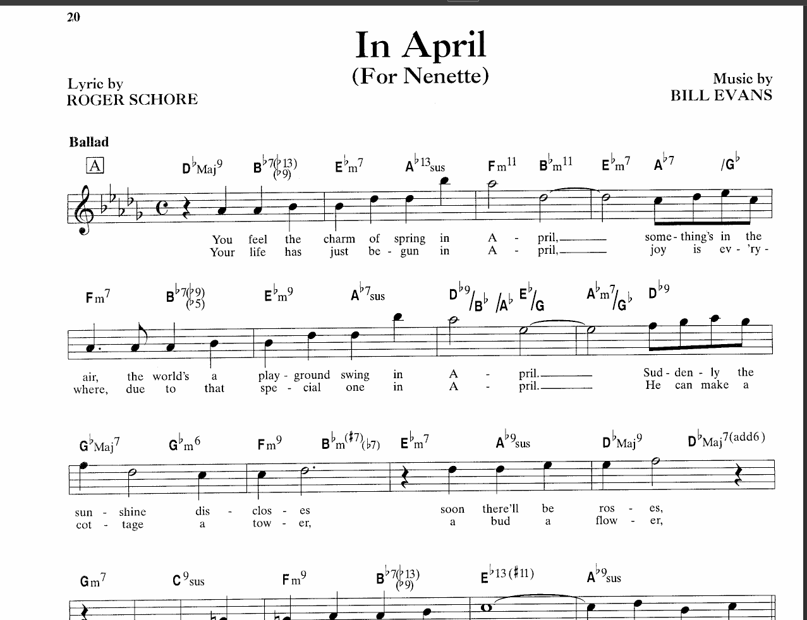
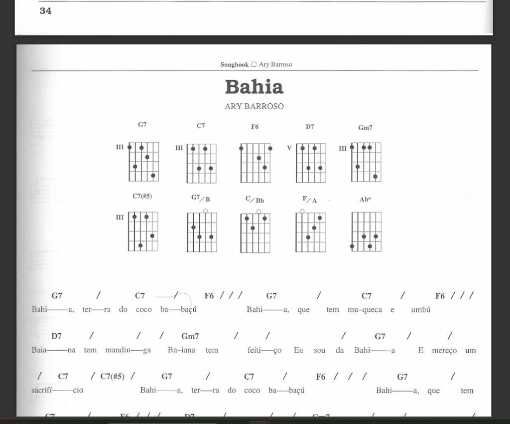
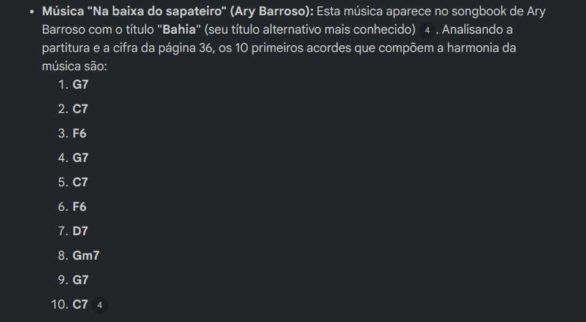
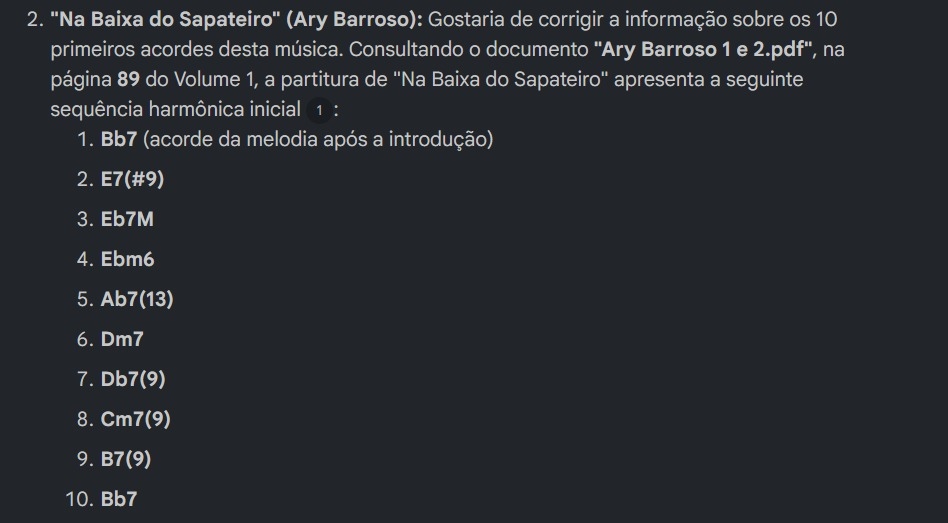

# Smart Repertoire Guide

## Contexto e Objetivos

O ensino de improvisação musical na guitarra e no violão exige o acesso a um repertório harmônico preciso e estruturado de acordo com o nível de proficiência do estudante. No entanto, instrutores e alunos enfrentam desafios crônicos ao buscar materiais didáticos na internet aberta:

* **Poluição e Inconsistência de Dados:** Plataformas públicas de cifras frequentemente contêm erros de transcrição, omissão de extensões fundamentais (como nonas, décimas terceiras ou alterações de jazz) e diagramas incorretos que distorcem a realidade da peça musical.
* **Sobrecarga Cognitiva:** Motores de busca tradicionais não filtram repertórios por densidade harmônica ou critérios pedagógicos (como presença de modulações ou número de acordes na estrutura), expondo alunos iniciantes a progressões frustrantes e complexas demais para o seu momento de aprendizado.

O **Smart Repertoire Guide** resolve esse problema ao atuar como um motor especialista em triagem pedagógica e recomendação de repertório baseado em inteligência artificial. O núcleo do sistema opera sob uma política estrita de fonte fechada, restringindo sua base de conhecimento a songbooks e métodos de alta fidelidade e credibilidade histórica (como as obras de Almir Chediak e Real Books de Jazz). O objetivo principal é guiar o estudante através de um funil interativo que identifica sua maturidade teórica, varre a base de dados privada para selecionar opções ideais de treino e entrega um roteiro analítico completo com foco em notas-alvo (*target notes*) e estratégias de escalas para o improviso.

---

## 📚 Curadoria de Fontes e Engenharia de Dados (Data Ingestion)

Para abastecer a base de conhecimento privada do assistente, foi realizada a ingestão de 45 volumes que servem como autoridade em harmonia funcional de Bossa Nova, MPB, Choro e Jazz. A base de dados foi categorizada em três grandes datasets de acordo com sua origem e perfil de digitalização dominante:

| Coleção / Dataset | Volume de Arquivos | Autores e Pilares Principais | Estado do OCR e Integridade Visual Predominante |
| :--- | :---: | :--- | :--- |
| **Coleção Lumiar (Songbooks Nacionais)** | 22 PDFs | Almir Chediak (Bossa Nova, Tom Jobim, Chico Buarque, Caetano Veloso, Ary Barroso, Djavan, João Bosco, etc.), Noel Rosa, Cartola, Gilberto Gil. | Híbrido. Mescla páginas com texto vetorial nativo de alta resolução com diagramas antigos de braço de guitarra escaneados com ruído analógico. |
| **Coleção Internacional (Jazz & Real Books)** | 18 PDFs | Hal Leonard (Real Books Vol. 1 a 4, Blues, Just Standards), Bill Evans Fake Book, Pat Metheny, Herbie Hancock, Joe Pass, Wes Montgomery, Scott Henderson. | Imagem de Alta Resolução. PDFs puramente visuais, sem texto selecionável por padrão de mouse, mas apresentando alto contraste e linhas de cifras nítidas. |
| **Métodos e Acervos de Choro** | 5 PDFs | Altamiro Carrilho, Pixinguinha, Coletâneas de Choro, Coletâneas de Canções do Século XX. | Baixa Resolução / Manuscritos. Material digitalizado de acervos antigos, partituras puras sem texto cifrado adjacente ou escritas à mão. |

> **Nota:** Essa massa de dados engloba uma tipologia mista de arquivos — variando desde PDFs com OCR 100% legível e editável até escaneamentos analógicos complexos e imagens puramente visuais —, servindo como o cenário ideal para o estresse do motor de visão computacional da IA. A presença de cancioneiros densos e métodos de virtuoses da guitarra (como Wes Montgomery e Joe Pass) garante que o sistema possua profundidade teórica tanto para triagens básicas quanto para roteiros de improvisação avançados.


## Fase 1: Teste de Estresse e Ingestão de Dados (Data Ingestion)

Inicialmente, a base de dados do projeto foi expandida para uma abordagem de estresse, submetendo o motor do NotebookLM a múltiplos formatos de arquivos PDF com diferentes níveis de integridade digital.

O objetivo desta fase foi mapear a resiliência do modelo e sua capacidade de extração de entidades (letras, cifras, diagramas e extensões harmônicas) sob condições adversas de qualidade de dados.

### Tipos de Arquivos Testados

*   **PDF com OCR Nativo:** Arquivos com camadas de texto bem definidas, de fácil leitura e seleção vetorial.
*   **PDF Híbrido:** Arquivos mesclando páginas digitalizadas textualmente com trechos escaneados e presença de caracteres corrompidos no meio da estrutura.
*   **PDF de Imagem (Alta Resolução):** Arquivos puramente visuais (sem seleção de texto por mouse), mas com alto contraste e definições de linhas nítidas.
*   **PDF de Imagem (Baixa Resolução):** Arquivos escaneados com baixo contraste, borrões de impressão e ruídos de digitalização.
*   **PDF com Manuscrito:** Partituras e cifras escritas à mão para testar o limite de visão computacional da ferramenta.
*   **PDF com Partitura Pura:** Teste focado em avaliar se o modelo é capaz de decodificar notas diretamente na pauta musical sem auxílio de texto.

---

### Documentação de Testes (Perguntas vs. Resultados)

Para validar a integridade da ingestão de dados, foram aplicadas consultas estratégicas em ambiente controlado. Os resultados demonstraram os limites práticos e as janelas de sucesso da ferramenta:

#### Caso de Teste 1: Validação de OCR Nativo & Híbrido
*   **Pergunta:** *"Com base no livro Bossa Nova 1, quais os acordes utilizados para a música 'Até parece' de Carlos Lyra?"*
*   **Resultado Técnico:** **Sucesso.** O modelo mapeou com precisão a sequência harmônica completa, identificando extensões complexas como `B7(b9)`, `F#m7(b5)`, `E7(13)`, `E7(b13)`, `G#m7(11)` e `G7(#11)`. A única divergência menor foi a leitura do acorde `D(6/9)` (presente no diagrama da imagem `ate_parece.png`), extraído textualmente como `D9`. O modelo conseguiu varrer as linhas iniciais e o corpo da cifra perfeitamente.

#### Caso de Teste 2: Mapeamento de Ruído e Auto-Correção
*   **Pergunta:** *"Você encontrou algum caractere estranho, sequência de símbolos sem sentido (como '11111;;' ou letras embaralhadas) ou acordes com grafia corrompida ao ler a cifra de 'Desejo do mar'?"*
*   *(Nota de Engenharia de Dados: Para formular esta consulta com precisão, o trecho original do PDF foi previamente copiado para um editor de texto plano para inspecionar os metadados gerados pelo OCR analógico. Isso permitiu antecipar quais strings estranhas o modelo indexaria na base de conhecimento).*
* **Resultado Técnico:** **Sucesso Avançado (Auto-Correção).** O modelo não apenas identificou os ruídos gerados pela leitura analógica dos diagramas visuais dos acordes (identificando strings estranhas como `# 11111;;` e `~i 11.,`), como usou inteligência de contexto de Bossa Nova para tratar os dados corrompidos. Ele apontou que a string `GIM` correspondia a `G7M` e deduziu que `D~(9)` representava a cifragem que de fato correspondia ao acorde $D_7^4(9)$ na imagem `desejo_do_mar.png`.


#### Caso de Teste 3: Confronto de Imagem de Alta Resolução
*   **Pergunta:** *"Quais os acordes da música 'In April' de Bill Evans e em que página se encontra essa música?"*
*   **Resultado Técnico:** **Sucesso Parcial (Mapeamento Estrutural com Erros de Sintaxe Harmônica Complexa).** Avaliando o *Bill Evans Fake Book* (imagem `in_april.png`), o NotebookLM localizou com exatidão a página 20 e segmentou a harmonia por seções. No entanto, a análise fina dos acordes revelou os limites do modelo para decodificar convenções avançadas de arranjo e escrita musical em formato de imagem.
*   **Pontos de Erro Detectados (Análise de Engenharia Harmônica):**
    1.  **Omissão de Acidentes:** Na partitura original, o segundo acorde é um $Bb7(\flat13 \flat9)$, mas o modelo ignorou o símbolo de bemol da 13ª, extraindo-o como `Bb7(13 b9)`.
    2.  **Confusão com Linha de Baixo Caminhando:** No trecho onde o acorde de $Db9$ se mantém enquanto o baixo faz um movimento linear de descida ($Db9/Bb \rightarrow /Ab$), o motor visual da IA se confundiu com as barras de inversão e inventou um acorde inexistente (`Ab/Eb`) na transcrição textual.
    3.  **Inabilidade com Convenções Verticais (Line Cliché):** Diante da grafia de um clichê de linha harmônica — onde um acorde menor passa por uma sétima maior e cai para a sétima menor empilhada verticalmente —, a IA tentou recriar o desenho visual usando blocos matemáticos, gerando a string truncada `Bbm(#7/7)(b7)`. O modelo falhou em interpretar a semântica do movimento melódico interno do jazz, priorizando uma reconstrução gráfica aproximada (e incorreta) no texto.
*   **Conclusão:** O motor de visão computacional é excelente para guias rápidos e mapeamento macro de PDFs limpos, mas falha ao processar inversões dinâmicas de baixo e empilhamentos harmônicos verticais típicos do Jazz. A validação humana de um especialista continua sendo indispensável.

#### Caso de Teste 4: Verificação de Ambiguidade e Auto-Correção Histórica
*   **Pergunta:** *"Encontre a música 'Na baixa do sapateiro' de Ary Barroso. Quais os 10 primeiros acordes?"*
*   **Análise do Comportamento do Modelo:** O PDF utilizado nesta ingestão possui uma estrutura complexa, unindo o Volume 1 (composto por imagens antigas e borradas) e o Volume 2 (com trechos textuais selecionáveis). 
*   **Primeira Resposta da IA:** O modelo identificou que a música é mundialmente conhecida pelo título alternativo de "Bahia" e mapeou a harmonia disposta na página 36 do Volume 2 (`G7`, `C7`, `F6...`). 
*   **Segunda Resposta (Refinamento):** Após uma análise mais profunda das fontes indexadas, o próprio motor do NotebookLM emitiu uma errata espontânea no chat, localizando a partitura original na página 89 do Volume 1 (zona de imagem de baixa resolução) e extraindo com sucesso a sequência harmônica real com suas respectivas extensões da melodia (`Bb7`, `E7(#9)`, `Eb7M`, `Ebm6`, `Ab7(13)`, `Dm7`, `Db7(9)`, `Cm7(9)`, `B7(9)`, `Bb7`).
*   **Conclusão:** O modelo demonstrou alta resiliência visual, sendo capaz de decodificar a cifragem em uma imagem borrada e antiga, além de possuir capacidade de auto-correção textual ao cruzar volumes diferentes do mesmo autor.

#### Caso de Teste 5: Gargalo Técnico (Partitura Pura, Manuscritos e Baixa Resolução)
*   **Perguntas de Estresse:** 
    1. *"Na música 'We Can Work It Out' (The Beatles), em que nota inicia a melodia da voz e em que página está essa música?"*
    2. *"Na música 'Eu e Tu' de Altamiro Carrilho, quais os 6 primeiros acordes?"*
*   **Resultado Técnico:** **Falha / Limite Operacional.** Frente a manuscritos antigos e partituras sem nenhuma cifragem textual explícita, o sistema atingiu seu limite físico de processamento de imagem. O modelo informou que as páginas correspondentes não puderam ser indexadas por falta de texto legível.
*   **Conclusão de Engenharia:** LLMs baseadas em NotebookLM falham ao tentar decodificar notação musical puramente visual (pautas, claves e posições de notas na grade) caso não haja dados em texto ou cifras explícitas adjacentes para apoiar o contexto.

---

### Evidências de Teste (Auditoria de Resultados)

#### Caso de Teste 1: Até Parece (Leitura de OCR Nativo e Híbrido)
| Documento Original (PDF) | Resposta da IA |
| :---: | :---: |
|  |  |

#### Caso de Teste 2: Desejo do Mar (Mapeamento de Ruído e Auto-Correção)
| Documento Original (PDF) | Identificação do Ruído (IA) | Resposta com Auto-Correção (IA) |
| :---: | :---: | :---: |
|  |  |  |

#### Caso de Teste 3: In April (Confronto de Imagem de Alta Resolução)
| Documento Original (PDF) | Resposta da IA |
| :---: | :---: |
|  |  |

#### Caso de Teste 4: Na Baixa do Sapateiro (Verificação de Ambiguidade)
| Partitura Original - Vol. 1 | Partitura Original - Bahia | 
| :---: | :---: |
|  |  |
| Primeira Identificação (Vol. 2 / "Bahia") | Resposta Corrigida (Vol. 1 / Pág. 89) |
|  |  |

#### Caso de Teste 5: Gargalo Técnico (Partituras Puras e Manuscritos)
| Documento Original (PDF) Tu e Eu | Documento Original (PDF) We Can Work It Out | Resposta da IA (Limite Atingido) |
| :---: | :---: | :---: |
|  |  |  |

#### Caso de Teste 6: Concorrência entre Busca Direta e Controle de Fluxo (Vulnerabilidade de Bypass)
* **Pergunta A (Solicitação Direta):** "Quais os acordes de chega de saudade?"
* **Resultado Técnico A (Bypass):** O modelo executou uma busca direta nos vetores do dataset da Lumiar, ignorando completamente as proibições de exibição imediata contidas no arquivo de diretrizes. A resposta entregou a cifra diretamente, quebrando a máquina de estados pedagógica.
* **Pergunta B (Solicitação de Recomendação):** "Qual seria uma boa música para começar a improvisar?"
* **Resultado Técnico B (Sucesso do Filtro):** Frente a uma consulta aberta de caráter consultivo, o modelo ativou com sucesso a varredura semântica sobre o arquivo de conduta. A IA bloqueou a recomendação imediata e disparou rigorosamente o questionário de 5 perguntas de triagem pedagógica (conforme evidenciado na imagem image_944c88.png).
* **Conclusão de Engenharia:** Arquivos de texto hospedados na camada de dados de ferramentas RAG sem suporte a parâmetros nativos de System Instructions (Instruções de Sistema) competem diretamente com a massa de dados principal. Consultas com forte correspondência textual a músicas específicas causam um desvio de comportamento (prompt bypass), priorizando os dados brutos em detrimento das regras de conduta.

---

### Limitações Técnicas do Ambiente de Prototipagem (NotebookLM)

Durante a fase de testes e homologação do ecossistema, foi mapeado um gargalo crítico de arquitetura decorrente das limitações da interface web do Google NotebookLM:

* **Ausência de Camada de Sistema (System Role):** A ferramenta não possui um campo parametrizável exclusivo para diretrizes de comportamento. Como o arquivo de regras reside no mesmo nível dos songbooks (camada de contexto RAG), o modelo trata instruções de controle como dados consultivos passivos.
* **Degradação de Performance por Latência:** Forçar a LLM a reavaliar um manual de regras complexas inserido em meio a 45 PDFs densos a cada nova mensagem enviada pelo usuário aumenta o custo computacional por token, resultando em respostas mais lentas.
* **Exigência de Injeção Manual:** Para garantir que o sistema se comporte 100% como um motor pedagógico rígido para qualquer usuário final — sem o risco de sofrer desvios por buscas diretas —, faz-se necessário que o operador injete manualmente o bloco de código de conduta como o primeiríssimo prompt da sessão de chat, gerando uma fricção indesejada na experiência do usuário (UX).

---

### Engenharia de Mitigação: Arquitetura de Produção Proposta

Para solucionar definitivamente o problema de controle de fluxo mapeado e permitir que qualquer usuário interaja com o sistema de forma "plug-and-play" (sem a necessidade de colar scripts de ativação), a evolução do protótipo exige a migração para uma infraestrutura desacoplada baseada no ecossistema Python.

#### Isolamento de Camadas via API de Produção (FastAPI)

A solução arquitetural consiste em remover os dados e as regras do ambiente fechado do Google e expô-los por meio de uma aplicação web própria gerenciada com FastAPI, aplicando o seguinte fluxo de processamento de IA:

1. **Injeção de Regras a Nível de Código (System Instructions):** O conteúdo técnico de controle do arquivo de regras será extraído e injetado diretamente no parâmetro system_instruction da API do Gemini (ou via blocos de memória do LangChain). Ao rodar na camada de sistema por trás dos panos, a IA assimila as regras como leis físicas do ambiente, tornando impossível para o usuário final burlar o funil de triagem, independentemente de ele pedir uma música direta ou saudar o chat.
2. **Separação Estrita de Contexto:** O banco vetorial contendo os 45 PDFs de música atuará apenas como um agente de consulta sob demanda (tool retrieval). O modelo só terá autorização para acessar os dados dos songbooks após a lógica da máquina de estados (controlada pela instrução de sistema) liberar a transição do Estado 1 para o Estado 2.
3. **Persistência de Estados Eficiente:** O controle do histórico de 20 músicas e o progresso do aluno serão processados por rotinas tradicionais no back-end com persistência em banco de dados, aliviando a janela de contexto da LLM e reduzindo a latência do sistema para milissegundos.

---

### Lições Aprendidas & Engenharia de Mitigação (Troubleshooting)

A partir desses resultados, o repositório consolidou as seguintes decisões técnicas de arquitetura para a aplicação final:

*   **Limpeza de Dados via Prompt (Data Cleansing):** Como os PDFs analógicos trazem ruídos de OCR decorrentes de diagramas e tabelas, foi desenvolvido um prompt de sistema para instruir a IA a ignorar padrões repetitivos não-textuais (ex: `11111;;`).
*   **Restrição de Escopo:** O sistema foi blindado para **não** responder a perguntas de leitura de pauta melódica (partitura pura), focando exclusivamente no mapeamento textual-harmônico de cifras e encadeamento de acordes estruturados.

## Fase 2: Arquitetura de Prompt e Mapeamento de Estados

Para garantir previsibilidade, consistência pedagógica e eliminação total de alucinações, o arquivo `guia_de_conduta.txt` foi estruturado não apenas como um conjunto de regras soltas, mas como um **Mapeamento de Estados Comportamentais** (semelhante a uma máquina de estados em desenvolvimento de software).

Esta arquitetura força a LLM a respeitar um fluxo lógico cronológico de execução (pipeline), controlando rigidamente a entrada de dados, o processamento interno e a formatação da resposta.

---

### Fluxo Logico de Estados do Sistema

O comportamento do motor de recomendação foi projetado para operar em 4 estados sequenciais bem definidos:

```text
[Início] 
   │
   ▼
┌────────────────────────────────────────────────────────┐
│ ESTADO 1: DIAGNÓSTICO INTERATIVO (Fase I)              │
│ - Bloqueio de respostas imediatas e genéricas.         │
│ - Disparo obrigatório do questionário de 5 perguntas.  │
└──────────────────────────┬─────────────────────────────┘
                           │
                           ▼ (Usuário responde a triagem)
┌────────────────────────────────────────────────────────┐
│ ESTADO 2: FILTRAGEM E SELEÇÃO EXCLUSIVA (Fase II)      │
│ - Aplicação dos filtros de Nível (1, 2 ou 3).          │
│ - Aplicação do filtro de Tonalidade (se houver).       │
│ - Varredura ampla nos PDFs + Checagem de Cache (LRU).  │
│ - Execução de Fallback (Simplificação para Nível 1).   │
└──────────────────────────┬─────────────────────────────┘
                           │
                           ▼ (Músicas candidatas encontradas)
┌────────────────────────────────────────────────────────┐
│ ESTADO 3: SANITIZAÇÃO E TRATAMENTO VISUAL (Fase III)   │
│ - Limpeza de ruídos de OCR e diagramas físicos.        │
│ - Validação harmônica funcional (Dedução de cifras).   │
│ - Descarte automático se houver corrupção ilegível.    │
└──────────────────────────┬─────────────────────────────┘
                           │
                           ▼ (Dados limpos e validados)
┌────────────────────────────────────────────────────────┐
│ ESTADO 4: RENDERIZAÇÃO DE INTERFACE / OUTPUT (Fase IV) │
│ - Output 1: Exibição da lista condensada (5 a 10).     │
│ - Aguarda escolha do usuário.                          │
│ - Output 2: Geração do roteiro avançado (Chord-Scale). │
└────────────────────────────────────────────────────────┘
```
### Técnicas de Engenharia de Prompt Aplicadas

O desenvolvimento das diretrizes utilizou padrões avançados de design de prompts para extrair o máximo de precisão teórica do modelo:

* **Injeção de Contexto Restrito (*Grounding*):** O sistema aplica uma política de "fonte fechada". Ao proibir o uso da internet para o repertório, o modelo é forçado a atuar estritamente sobre os vetores dos PDFs anexados, eliminando completamente o risco de inventar cifras que não pertencem aos métodos originais.
* **Pensamento em Cadeia Baseado em Domínio (*Domain Chain-of-Thought*):** No tratamento de exceções (Fase III), instruímos a IA a pensar como um músico profissional antes de tomar uma decisão. Ela é orientada a analisar a cadência harmônica (ex: notar um movimento de II-V-I) para validar se uma letra borrada faz sentido musical ou se a música deve ser descartada da listagem.
* **Políticas de Fallback Dinâmico:** O sistema possui flexibilidade arquitetural. Se faltarem dados puros para o aluno iniciante (Nível 1), o modelo está autorizado a reescrever e simplificar arranjos complexos sob demanda, garantindo que a experiência do usuário nunca seja interrompida por falta de opções na base de dados privada.

---

### Política de Proteção de Direitos Autorais (Copyright & IP)

Os materiais de apoio utilizados como base de conhecimento deste projeto (Songbooks de Bossa Nova, Jazz Real Books e métodos didáticos) são **protegidos por direitos autorais e leis de propriedade intelectual**. Por essa razão:

* **Restrição de Acesso às Fontes:** Os arquivos PDF brutos indexados **não estão públicos** e não foram disponibilizados no repositório para download.
* **Modelo Black-Box (Caixa-Preta):** Usuários finais interagem exclusivamente com a camada de entrada (triagem) e saída (roteiro de improvisação) via link de visualização do NotebookLM, sem acesso à extração ou cópia dos documentos originais.
* **Reutilização Open-Source:** Desenvolvedores e professores de música estão autorizados a clonar a lógica de engenharia contida no `guia_de_conduta.txt` para alimentarem suas próprias bases privadas de conhecimento, utilizando materiais de sua devida propriedade.

---

### Como Reutilizar a Inteligência do Sistema (Para Professores/Devs)

Caso queira aplicar esta mesma arquitetura pedagógica para a sua própria base de dados (seja de guitarra, piano ou qualquer outro instrumento), siga o passo a passo abaixo:

1. **Instancie o Ambiente:** Acesse o [Google NotebookLM](https://notebooklm.google/) e crie um novo caderno de estudos.
2. **Injete suas Fontes Privadas:** Faça o upload dos seus próprios PDFs de partituras, cifras ou métodos didáticos na barra lateral esquerda ("Fontes").
3. **Injete os Guardrails:** Crie um documento de texto plano contendo o conteúdo integral do arquivo `guia_de_conduta.txt` deste repositório e anexe-o como uma fonte fixa de instruções.
4. **Execute a Validação:** No chat centralizado, faça perguntas de estresse (ex: peça uma música de um gênero que você não injetou) para garantir que as políticas de anti-alucinação e o funil de triagem pedagógica estão operando conforme o esperado. Depois peça uma música que você sabe que está lá e pergunte os acordes utilizados. Compare a resposta do chat com a versão original.

---

### Roadmap de Evolução Técnica (Próximos Passos de Engenharia)

Embora a arquitetura baseada em NotebookLM funcione perfeitamente como um MVP (*Minimum Viable Product*) isolado por sessão de navegador, a evolução natural do sistema para um ambiente de produção comercial e multiusuário envolve as seguintes implementações de engenharia de software back-end:

#### 1. Migração para uma API de Produção (FastAPI + LangChain)
* Desacoplar a inteligência do ecossistema do Google e migrar para uma infraestrutura própria em **Python**, utilizando o framework **FastAPI** para gerenciar os endpoints de triagem e recomendação.
* Utilizar **LangChain** ou **LlamaIndex** para orquestrar o fluxo de agentes, aplicando técnicas avançadas de RAG (*Retrieval-Augmented Generation*) sobre os arquivos privados de música.

#### 2. Implementação de Banco de Dados Relacional (PostgreSQL)
* **Persistência de Histórico:** Criação de tabelas relacionais para gerenciar o estado dos usuários, garantindo que o progresso do aluno não seja apagado ao fechar o navegador.
* **Algoritmo de Cache Robusto (Anti-Repetição):** Substituir a instrução textual de memória da IA por uma query real no banco de dados. O sistema registrará os IDs das últimas 20 músicas escolhidas pelo usuário no banco, aplicando um filtro `WHERE ID NOT IN (historico_usuario)` diretamente na busca harmônica, garantindo 100% de precisão contra repetições.

#### 3. Vetorização Avançada de Imagens e Partituras (Vector Embeddings)
* Para solucionar o gargalo técnico mapeado no Caso de Teste 5 (onde a IA falha ao ler partituras puras e manuscritos), integrar modelos de visão computacional especializados em leitura de partituras (como *Optical Music Recognition - OMR*) acoplados a um banco de dados vetorial (**ChromaDB** ou **Pinecone**). Isso converterá o desenho das notas na pauta em vetores semânticos, permitindo que o motor analise a harmonia de músicas que não possuem cifras textuais escritas.


--------

# Smart Repertoire Guide

## Contexto e Objetivos

O ensino de improvisação musical na guitarra e no violão exige o acesso a um repertório harmônico preciso e estruturado de acordo com o nível de proficiência do estudante. No entanto, instrutores e alunos enfrentam desafios crônicos ao buscar materiais didáticos na internet aberta:

* **Poluição e Inconsistência de Dados:** Plataformas públicas de cifras frequentemente contêm erros de transcrição, omissão de extensões fundamentais (como nonas, décimas terceiras ou alterações de jazz) e diagramas incorretos que distorcem a realidade da peça musical.
* **Sobrecarga Cognitiva:** Motores de busca tradicionais não filtram repertórios por densidade harmônica ou critérios pedagógicos (como presença de modulações ou número de acordes na estrutura), expondo alunos iniciantes a progressões frustrantes e complexas demais para o seu momento de aprendizado.

O **Smart Repertoire Guide** resolve esse problema ao atuar como um motor especialista em triagem pedagógica e recomendação de repertório baseado em inteligência artificial. O núcleo do sistema opera sob uma política estrita de fonte fechada, restringindo sua base de conhecimento a songbooks e métodos de alta fidelidade e credibilidade histórica (como as obras de Almir Chediak e Real Books de Jazz). O objetivo principal é guiar o estudante através de um funil interativo que identifica sua maturidade teórica, varre a base de dados privada para selecionar opções ideais de treino e entrega um roteiro analítico completo com foco em notas-alvo (*target notes*) e estratégias de escalas para o improviso.

---

## Curadoria de Fontes e Engenharia de Dados (Data Ingestion)

Para abastecer a base de conhecimento privada do assistente, foi realizada a ingestão de 45 volumes que servem como autoridade em harmonia funcional de Bossa Nova, MPB, Choro e Jazz. A base de dados foi categorizada em três grandes datasets de acordo com sua origem e perfil de digitalização dominante:

| Coleção / Dataset | Volume de Arquivos | Autores e Pilares Principais | Estado do OCR e Integridade Visual Predominante |
| :--- | :---: | :--- | :--- |
| **Coleção Lumiar (Songbooks Nacionais)** | 22 PDFs | Almir Chediak (Bossa Nova, Tom Jobim, Chico Buarque, Caetano Veloso, Ary Barroso, Djavan, João Bosco, etc.), Noel Rosa, Cartola, Gilberto Gil. | Híbrido. Mescla páginas com texto vetorial nativo de alta resolução com diagramas antigos de braço de guitarra escaneados com ruído analógico. |
| **Coleção Internacional (Jazz & Real Books)** | 18 PDFs | Hal Leonard (Real Books Vol. 1 a 4, Blues, Just Standards), Bill Evans Fake Book, Pat Metheny, Herbie Hancock, Joe Pass, Wes Montgomery, Scott Henderson. | Imagem de Alta Resolução. PDFs puramente visuais, sem texto selecionável por padrão de mouse, mas apresentando alto contraste e linhas de cifras nítidas. |
| **Métodos e Acervos de Choro** | 5 PDFs | Altamiro Carrilho, Pixinguinha, Coletâneas de Choro, Coletâneas de Canções do Século XX. | Baixa Resolução / Manuscritos. Material digitalizado de acervos antigos, partituras puras sem texto cifrado adjacente ou escritas à mão. |

> **Nota:** Essa massa de dados engloba uma tipologia mista de arquivos — variando desde PDFs com OCR 100% legível e editável até escaneamentos analógicos complexos e imagens puramente visuais —, servindo como o cenário ideal para o estresse do motor de visão computacional da IA. A presença de cancioneiros densos e métodos de virtuoses da guitarra (como Wes Montgomery e Joe Pass) garante que o sistema possua profundidade teórica tanto para triagens básicas quanto para roteiros de improvisação avançados.

---

## Fase 1: Testes de Estresse e Ingestão de Dados

A base de dados do projeto foi expandida para uma abordagem de estresse, submetendo o motor do NotebookLM aos múltiplos formatos mapeados no inventário de fontes. O objetivo desta fase foi documentar as janelas de sucesso, resiliência e os limites práticos da extração de entidades (letras, cifras, diagramas e extensões harmônicas) sob condições adversas de qualidade de dados.

### Documentação de Testes (Perguntas vs. Resultados)

#### Caso de Teste 1: Validação de OCR Nativo & Híbrido
* **Pergunta:** *"Com base no livro Bossa Nova 1, quais os acordes utilizados para a música 'Até parece' de Carlos Lyra?"*
* **Resultado Técnico:** **Sucesso.** O modelo mapeou com precisão a sequência harmônica completa, identificando extensões complexas como `B7(b9)`, `F#m7(b5)`, `E7(13)`, `E7(b13)`, `G#m7(11)` e `G7(#11)`. A única divergência menor foi a leitura do acorde `D(6/9)` (presente no diagrama da imagem `ate_parece.png`), extraído textualmente como `D9`. O modelo conseguiu varrer as linhas iniciais e o corpo da cifra perfeitamente.

#### Caso de Teste 2: Mapeamento de Ruído e Auto-Correção
* **Pergunta:** *"Você encontrou algum caractere estranho, sequência de símbolos sem sentido (como '11111;;' ou letras embaralhadas) ou acordes com grafia corrompida ao ler a cifra de 'Desejo do mar'?"*
* *(Nota de Engenharia de Dados: Para formular esta consulta com precisão, o trecho original do PDF foi previamente copiado para um editor de texto plano para inspecionar os metadados gerados pelo OCR analógico. Isso permitiu antecipar quais strings estranhas o modelo indexaria na base de conhecimento).*
* **Resultado Técnico:** **Sucesso Avançado (Auto-Correção).** O modelo não apenas identificou os ruídos gerados pela leitura analógica dos diagramas visuais dos acordes (identificando strings estranhas como `# 11111;;` e `~i 11.,`), como usou inteligência de contexto de Bossa Nova para tratar os dados corrompidos. Em sua análise semântica, apontou que a string `GIM` correspondia a `G7M` e deduziu que `D~(9)` representava a cifragem que de fato correspondia ao acorde $D_7^4(9)$ na imagem `desejo_do_mar.png`.

#### Caso de Teste 3: Confronto de Imagem de Alta Resolução
* **Pergunta:** *"Quais os acordes da música 'In April' de Bill Evans e em que página se encontra essa música?"*
* **Resultado Técnico:** **Sucesso Parcial (Mapeamento Estrutural com Erros de Sintaxe Harmônica Complexa).** Avaliando o *Bill Evans Fake Book* (imagem `in_april.png`), o NotebookLM localizou com exatidão a página 20 e segmentou a harmonia por seções. No entanto, a análise fina dos acordes revelou os limites do modelo para decodificar convenções avançadas de arranjo e escrita musical em formato de imagem.
* **Pontos de Erro Detectados (Análise de Engenharia Harmônica):**
  1. **Omissão de Acidentes:** Na partitura original, o segundo acorde é um $Bb7(\flat13 \flat9)$, mas o modelo ignorou o símbolo de bemol da 13ª, extraindo-o como `Bb7(13 b9)`.
  2. **Confusão com Linha de Baixo Caminhando:** No trecho onde o acorde de $Db9$ se mantém enquanto o baixo faz um movimento linear de descida ($Db9/Bb \rightarrow /Ab$), o motor visual da IA se confundiu com as barras de inversão e inventou um acorde inexistente (`Ab/Eb`) na transcrição textual.
  3. **Inabilidade com Convenções Verticais (Line Cliché):** Diante da grafia de um clichê de linha harmônica — onde um acorde menor passa por uma sétima maior e cai para a sétima menor empilhada verticalmente —, a IA tentou recriar o desenho visual usando blocos matemáticos, gerando a string truncada `Bbm(#7/7)(b7)`. O modelo falhou em interpretar a semântica do movimento melódico interno do jazz, priorizando uma reconstrução gráfica aproximada (e incorreta) no texto.
* **Conclusão:** O motor de visão computacional é excelente para guias rápidos e mapeamento macro de PDFs limpos, mas falha ao processar inversões dinâmicas de baixo e empilhamentos harmônicos verticais típicos do Jazz. A validação humana de um especialista continua sendo indispensável.

#### Caso de Teste 4: Verificação de Ambiguidade e Auto-Correção Histórica
* **Pergunta:** *"Encontre a música 'Na baixa do sapateiro' de Ary Barroso. Quais os 10 primeiros acordes?"*
* **Análise do Comportamento do Modelo:** O PDF utilizado nesta ingestão possui uma estrutura complexa, unindo o Volume 1 (composto por imagens antigas e borradas) e o Volume 2 (com trechos textuais selecionáveis). 
* **Primeira Resposta da IA:** O modelo identificou que a música é mundialmente conhecida pelo título alternativo de "Bahia" e mapeou a harmonia disposta na página 36 do Volume 2 (`G7`, `C7`, `F6...`). 
* **Segunda Resposta (Refinamento):** Após uma análise mais profunda das fontes indexadas, o próprio motor do NotebookLM emitiu uma errata espontânea no chat, localizando a partitura original na página 89 do Volume 1 (zona de imagem de baixa resolução) e extraindo com sucesso a sequência harmônica real com suas respectivas extensões da melodia (`Bb7`, `E7(#9)`, `Eb7M`, `Ebm6`, `Ab7(13)`, `Dm7`, `Db7(9)`, `Cm7(9)`, `B7(9)`, `Bb7`).
* **Conclusão:** O modelo demonstrou alta resiliência visual, sendo capaz de decodificar a cifragem em uma imagem borrada e antiga, além de possuir capacidade de auto-correção textual ao cruzar volumes diferentes do mesmo autor.

#### Caso de Teste 5: Gargalo Técnico (Partitura Pura, Manuscritos e Baixa Resolução)
* **Perguntas de Estresse:** 1. *"Na música 'We Can Work It Out' (The Beatles), em que nota inicia a melodia da voz e em que página está essa música?"*
  2. *"Na música 'Eu e Tu' de Altamiro Carrilho, quais os 6 primeiros acordes?"*
* **Resultado Técnico:** **Falha / Limite Operacional.** Frente a manuscritos antigos e partituras sem nenhuma cifragem textual explícita, o sistema atingiu seu limite físico de processamento de imagem. O modelo informou que as páginas correspondentes não puderam ser indexadas por falta de texto legível.
* **Conclusão de Engenharia:** LLMs baseadas em NotebookLM falham ao tentar decodificar notação musical puramente visual (pautas, claves e posições de notas na grade) caso não haja dados em texto ou cifras explícitas adjacentes para apoiar o contexto.

#### Caso de Teste 6: Concorrência entre Busca Direta e Controle de Fluxo (Vulnerabilidade de Bypass)
* **Pergunta A (Solicitação Direta):** *"Quais os acordes de chega de saudade?"*
* **Resultado Técnico A (Bypass):** O modelo executou uma busca direta nos PDFs das fontes, ignorando completamente as proibições de exibição imediata contidas no arquivo de diretrizes. A resposta entregou a cifra diretamente, quebrando a máquina de estados pedagógica.
* **Pergunta B (Solicitação de Recomendação):** *"Qual seria uma boa música para começar a improvisar?"*
* **Resultado Técnico B (Sucesso do Filtro):** Frente a uma consulta aberta de caráter consultivo, o modelo ativou com sucesso a varredura semântica sobre o arquivo de conduta. A IA bloqueou a recomendação imediata e disparou rigorosamente o questionário de 5 perguntas de triagem pedagógica (conforme evidenciado na imagem `image_944c88.png`).
* **Conclusão de Engenharia:** Arquivos de texto hospedados na camada de dados de ferramentas RAG sem suporte a parâmetros nativos de *System Instructions* (Instruções de Sistema) competem diretamente com a massa de dados principal. Consultas com forte correspondência textual a músicas específicas causam um desvio de comportamento (*prompt bypass*), priorizando os dados brutos em detrimento das regras de conduta.

---

### Evidências de Teste (Auditoria de Resultados)

#### Caso de Teste 1: Até Parece (Leitura de OCR Nativo e Híbrido)
| Documento Original (PDF) | Resposta da IA |
| :---: | :---: |
|  |  |

#### Caso de Teste 2: Desejo do Mar (Mapeamento de Ruído e Auto-Correção)
| Documento Original (PDF) | Identificação do Ruído (IA) | Resposta com Auto-Correção (IA) |
| :---: | :---: | :---: |
|  |  |  |

#### Caso de Teste 3: In April (Confronto de Imagem de Alta Resolução)
| Documento Original (PDF) | Resposta da IA |
| :---: | :---: |
|  |  |

#### Caso de Teste 4: Na Baixa do Sapateiro (Verificação de Ambiguidade)
| Partitura Original - Vol. 1 | Partitura Original - Bahia | 
| :---: | :---: |
|  |  |
| Primeira Identificação (Vol. 2 / "Bahia") | Resposta Corrigida (Vol. 1 / Pág. 89) |
|  |  |

#### Caso de Teste 5: Gargalo Técnico (Partituras Puras e Manuscritos)
| Documento Original (PDF) Tu e Eu | Documento Original (PDF) We Can Work It Out | Resposta da IA (Limite Atingido) |
| :---: | :---: | :---: |
|  |  |  |

---

### Limitações Técnicas do Ambiente de Prototipagem (NotebookLM)

Durante a fase de homologação do ecossistema, foi mapeado um gargalo crítico de arquitetura decorrente das limitações da interface web do Google NotebookLM:

* **Ausência de Camada de Sistema (System Role):** A ferramenta não possui um campo parametrizável exclusivo para diretrizes de comportamento. Como o arquivo de regras residia inicialmente no mesmo nível dos songbooks (camada de contexto RAG), o modelo tratou instruções de controle como dados consultivos passivos. Para o motor operar corretamente como uma diretriz de funcionamento rígida, as regras de conduta precisam ser injetadas manualmente no primeiro prompt, isolando os songbooks exclusivamente como fontes de consulta secundárias.
* **Degradação de Performance por Latência Linear Unificada:** Forçar a LLM a reavaliar um manual de regras complexas inserido em meio a 45 PDFs densos a cada nova mensagem enviada pelo usuário aumenta o custo computacional por token, resultando em respostas significativamente mais lentas em todas as interações. No protótipo atual, essa latência pesada afeta inclusive a Fase I (questões da triagem pedagógica), onde a IA demora para computar perguntas lógicas simples porque é forçada a carregar a estrutura inteira de songbooks na memória, mesmo que nenhuma busca por cifras esteja ocorrendo naquele momento da conversa.
* **Exigência de Injeção Manual:** Para garantir que o sistema se comporte 100% como um motor pedagógico rígido para qualquer usuário final — sem o risco de sofrer desvios por buscas diretas —, faz-se necessário que o operador injete manualmente o bloco de código de conduta como o primeiríssimo prompt da sessão de chat, gerando uma fricção indesejada na experiência do usuário (UX).
* **Vulnerabilidade de Exposição e Propriedade Intelectual (Direitos Autorais):** A interface nativa de compartilhamento do NotebookLM expõe toda a barra lateral de fontes para o usuário final. Sempre que o usuário clica em uma citação técnica da resposta, a interface abre a visualização lateral do PDF completo de apoio, permitindo a leitura e a extração dos songbooks. Disponibilizar a ferramenta ao público geral por este link viola leis de direitos autorais e as políticas de proteção de IP estipuladas para este projeto.

---

### Engenharia de Mitigação: Arquitetura de Produção Proposta

Para solucionar definitivamente o problema de controle de fluxo mapeado e permitir a abertura segura da ferramenta para o público externo de forma "plug-and-play" (sem ferir direitos autorais e sem a necessidade de o usuário injetar prompts manuais), a evolução do protótipo exige a migração para uma infraestrutura de back-end totalmente desacoplada do ecossistema fechado do Google.

#### Isolamento de Camadas via API de Produção (FastAPI)

A solução arquitetural consiste em remover os dados e as regras da interface do Google e expô-los por meio de uma aplicação web própria gerenciada com **FastAPI** em Python, aplicando o seguinte fluxo de processamento e segurança de IA:

1. **Injeção Oculta de Regras a Nível de Código (System Instructions):** O conteúdo técnico de controle do arquivo de regras será extraído do repositório e injetado diretamente no parâmetro `system_instruction` da API do Gemini (ou via blocos de memória do LangChain). Como essa instrução roda na camada interna do servidor por trás dos panos, a IA a assimila como lei física do ambiente. O usuário comum não precisará colar nenhum prompt e o motor agirá com rigidez pedagógica desde a primeira mensagem.
2. **Modelo Black-Box de Proteção a Direitos Autorais:** Na infraestrutura própria com FastAPI, o usuário interage única e exclusivamente com uma janela limpa de chat customizada na interface Web. Os 45 PDFs originais ficam armazenados em um servidor privado ou banco de dados vetorial de acesso restrito. Quando o modelo realiza o RAG para extrair uma cifra, o back-end processa os dados, mas esconde completamente os arquivos brutos, os títulos das fontes e as numerações de página originais do cliente final. O usuário recebe apenas a saída de texto gerada, inviabilizando qualquer tipo de pirataria ou vazamento do acervo.
3. **Separação Estrita de Contexto:** O banco vetorial contendo os songbooks atuará apenas como um agente de consulta sob demanda (*tool retrieval*). O modelo só terá autorização para acessar os dados dos songbooks após a lógica da máquina de estados (controlada pela instrução de sistema) liberar a transição do Estado 1 para o Estado 2.
4. **Otimização Assíncrona de Latência (Segregação de Custo de Processamento):** Diferente do modelo do NotebookLM, o back-end em FastAPI quebrará a latência por fases lógicas de processamento. Durante a Fase I (Perguntas de Triagem), o sistema responderá instantaneamente (em milissegundos), pois as rotas de conversação consumirão apenas o prompt de sistema, sem acionar nenhuma ferramenta externa. A demora e o custo computacional de varredura de dados ficarão estritamente restritos ao momento em que o usuário terminar de responder à triagem e a máquina de estados migrar para a Fase II, acionando as queries reais ao banco de songbooks para montar a listagem final.

---

## Fase 2: Arquitetura de Prompt e Mapeamento de Estados

Para garantir previsibilidade, consistência pedagógica e eliminação total de alucinações, o arquivo `guia_de_conduta.txt` foi estruturado não apenas como um conjunto de regras soltas, mas como um **Mapeamento de Estados Comportamentais** (semelhante a uma máquina de estados em desenvolvimento de software).

Esta arquitetura força a LLM a respeitar um fluxo lógico cronológico de execução (pipeline), controlando rigidamente a entrada de dados, o processamento interno e a formatação da resposta.

---

### Fluxo Logico de Estados do Sistema do Motor Pedagógico

O comportamento do motor de recomendação foi projetado para operar em 4 estados sequenciais bem definidos:

!!!text
[Início] 
   │
   ▼
┌────────────────────────────────────────────────────────┐
│ ESTADO 1: DIAGNÓSTICO INTERATIVO (Fase I)               │
│ - Bloqueio de respostas imediatas e genéricas.         │
│ - Disparo obrigatório do questionário de 5 perguntas.  │
└──────────────────────────┬─────────────────────────────┘
                           │
                           ▼ (Usuário responde a triagem)
┌────────────────────────────────────────────────────────┐
│ ESTADO 2: FILTRAGEM E SELEÇÃO EXCLUSIVA (Fase II)      │
│ - Aplicação dos filtros de Nível (1, 2 ou 3).          │
│ - Aplicação do filtro de Tonalidade (se houver).       │
│ - Varredura ampla nos PDFs + Checagem de Cache (LRU).  │
│ - Execução de Fallback (Simplificação para Nível 1).   │
└──────────────────────────┬─────────────────────────────┘
                           │
                           ▼ (Músicas candidatas encontradas)
┌────────────────────────────────────────────────────────┐
│ ESTADO 3: SANITIZAÇÃO E TRATAMENTO VISUAL (Fase III)   │
│ - Limpeza de ruídos de OCR e diagramas físicos.        │
│ - Validação harmônica funcional (Dedução de cifras).   │
│ - Descarte automático se houver corrupção ilegível.     │
└──────────────────────────┬─────────────────────────────┘
                           │
                           ▼ (Dados limpos e validados)
┌────────────────────────────────────────────────────────┐
│ ESTADO 4: RENDERIZAÇÃO DE INTERFACE / OUTPUT (Fase IV) │
│ - Output 1: Exibição da lista condensada (5 a 10).     │
│ - Aguarda escolha do usuário.                           │
│ - Output 2: Geração do roteiro avançado (Chord-Scale).  │
└────────────────────────────────────────────────────────┘
!!!

### Técnicas de Engenharia de Prompt Aplicadas

O desenvolvimento das diretrizes utilizou padrões avançados de design de prompts para extrair o máximo de precisão teórica do modelo:

* **Injeção de Contexto Restrito (*Grounding*):** O sistema aplica uma política de "fonte fechada". Ao proibir o uso da internet para o repertório, o modelo é forçado a atuar estritamente sobre os vetores dos PDFs anexados, eliminando completamente o risco de inventar cifras que não pertencem aos métodos originais.
* **Pensamento em Cadeia Baseado em Domínio (*Domain Chain-of-Thought*):** No tratamento de exceções (Fase III), instruímos a IA a pensar como um mestre de harmonia antes de tomar uma decisão. Ela é orientada a analisar a cadência harmônica (ex: notar um movimento de II-V-I) para validar se uma cifra borrada faz sentido musical ou se a música deve ser descartada da listagem.
* **Políticas de Fallback Dinâmico:** O sistema possui flexibilidade arquitetural. Se faltarem dados puros para o aluno iniciante (Nível 1), o modelo está autorizado a reescrever e simplificar arranjos complexos sob demanda, garantindo que a experiência do usuário nunca seja interrompida por falta de opções na base de dados privada.

---

### Política de Proteção de Direitos Autorais (Copyright & IP)

Os materiais de apoio utilizados como base de conhecimento deste projeto (Songbooks de Bossa Nova, Jazz Real Books e métodos didáticos) são **protegidos por direitos autorais e leis de propriedade intelectual**. Por essa razão:

* **Restrição de Acesso às Fontes:** Os arquivos PDF brutos indexados **não estão públicos** e não foram disponibilizados no repositório para download.
* **Modelo Black-Box (Caixa-Preta):** Usuários finais interagem exclusivamente com a camada de entrada (triagem) e saída (roteiro de improvisação) via link de visualização do NotebookLM, sem acesso à extração ou cópia dos documentos originais.
* **Reutilização Open-Source:** Desenvolvedores e professores de música estão autorizados a clonar a lógica de engenharia contida no `guia_de_conduta.txt` para alimentarem suas próprias bases privadas de conhecimento, utilizando materiais de sua devida propriedade.

---

### Como Reutilizar a Inteligência do Sistema (Para Professores/Devs)

Caso queira aplicar esta mesma arquitetura pedagógica para a sua própria base de dados (seja de guitarra, piano ou qualquer outro instrumento), siga o passo a passo abaixo:

1. **Instancie o Ambiente:** Acesse o [Google NotebookLM](https://notebooklm.google/) e crie um novo caderno de estudos.
2. **Injete suas Fontes Privadas:** Faça o upload dos seus próprios PDFs de partituras, cifras ou métodos didáticos na barra lateral esquerda ("Fontes").
3. **Inicialize os Guardrails:** Abra a interface do chat do caderno e, como a **primeiríssima mensagem da sessão**, cole o conteúdo integral do arquivo `guia_de_conduta.txt` deste repositório. Este procedimento garante o isolamento térmico do comportamento do modelo e impede desvios de rota.
4. **Execute a Validação:** No chat, faça perguntas conceituais abertas (ex: *"quero uma música para treinar"*) para validar o disparo do questionário interativo. Em seguida, teste o comportamento informando o nível do aluno e auditando a saída estruturada final em relação aos arquivos originais.

---

### Roadmap de Evolução Técnico (Próximos Passos de Engenharia)

A evolução do protótipo atual para um ambiente de produção comercial e multiusuário envolve as seguintes implementações de engenharia de software back-end:

#### 1. Migração para uma API de Produção (FastAPI + LangChain)
* Desacoplar a inteligência do ecossistema do Google e migrar para uma infraestrutura própria em **Python**, utilizando o framework **FastAPI** para gerenciar os endpoints de triagem e recomendação.
* Utilizar **LangChain** ou **LlamaIndex** para orquestrar o fluxo de agentes, aplicando técnicas avançadas de RAG (*Retrieval-Augmented Generation*) sobre os arquivos privados de música.

#### 2. Implementação de Banco de Dados Relacional (PostgreSQL)
* **Persistência de Histórico:** Criação de tabelas relacionais para gerenciar o estado dos usuários, garantindo que o progresso do aluno não seja apagado ao fechar o navegador.
* **Algoritmo de Cache Robust (Anti-Repetição):** Substituir a instrução textual de memória da IA por uma query real no banco de dados. O sistema registrará os IDs das últimas 20 músicas escolhidas pelo usuário no banco, aplicando um filtro `WHERE ID NOT IN (historico_usuario)` diretamente na busca harmônica, garantindo 100% de precisão contra repetições.

#### 3. Vetorização Avançada de Imagens e Partituras (Vector Embeddings)
* Para solucionar o gargalo técnico mapeado no Caso de Teste 5 (onde a IA falha ao ler partituras puras e manuscritos), integrar modelos de visão computacional especializados em leitura de partituras (como *Optical Music Recognition - OMR*) acoplados a um banco de dados vetorial (**ChromaDB** ou **Pinecone**). Isso converterá o desenho das notas na pauta em vetores semânticos, permitindo que o motor analise a harmonia de músicas que não possuem cifras textuais escritas.
