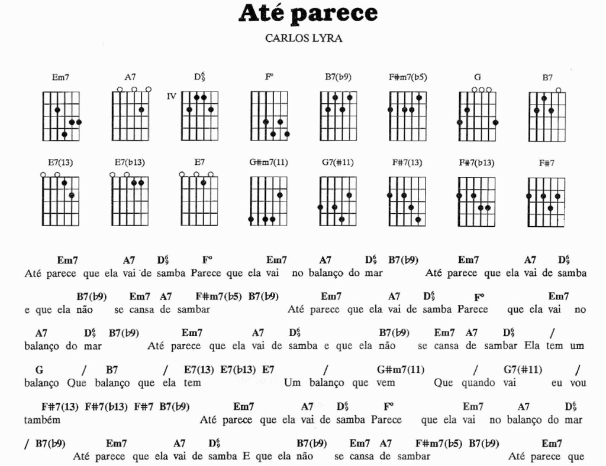
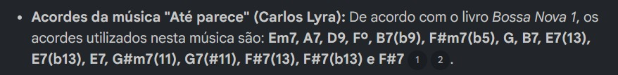
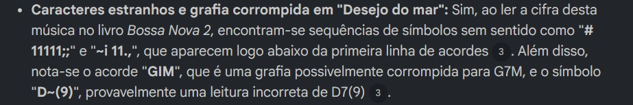
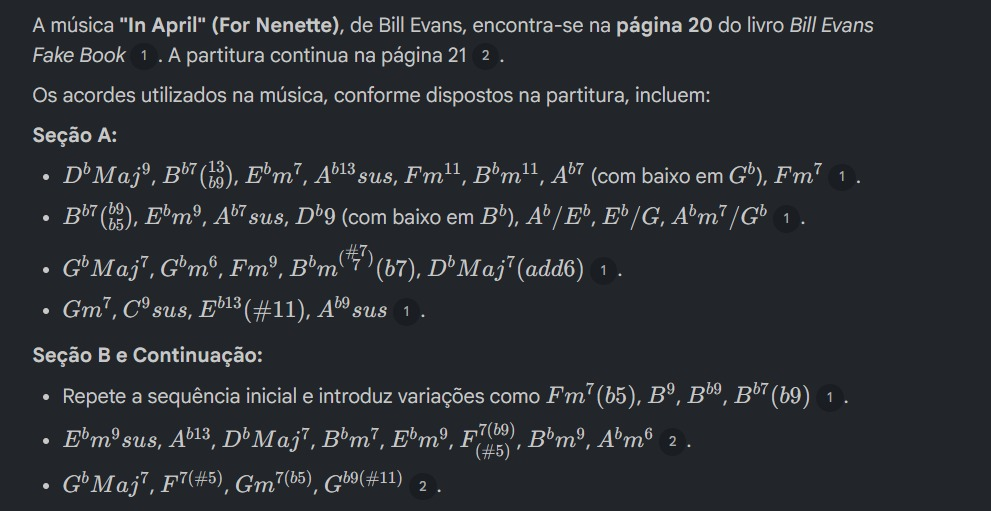
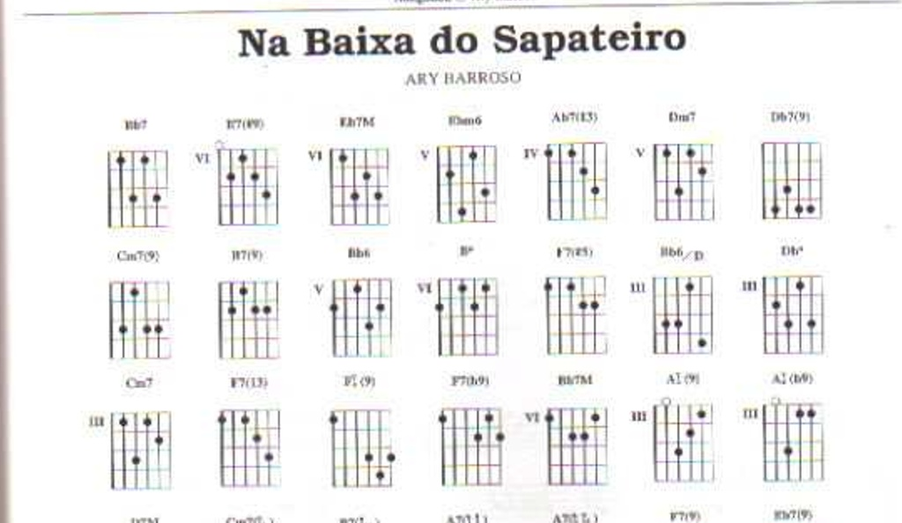
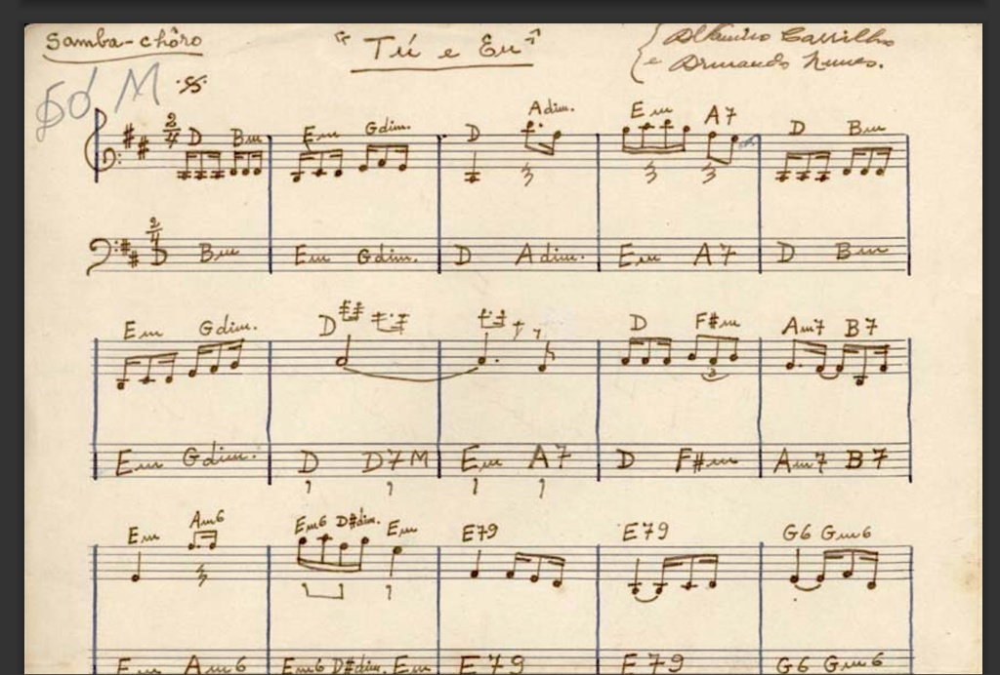
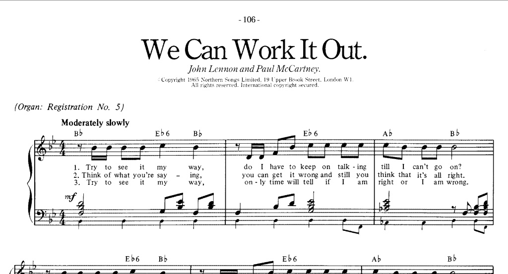
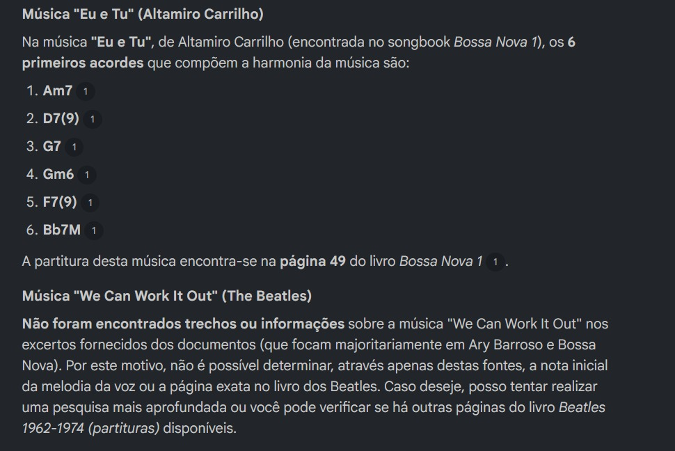

# Smart Repertoire Guide

## Context and Objectives

This project was developed as an integral practical component of the **Bradesco Bootcamp - GenAI, Data & Cyber**, in partnership with **DIO (Digital Innovation One)**. The objective is to apply concepts of data curation, contextualized artificial intelligence (RAG - *Retrieval-Augmented Generation*), and prompt engineering to construct a learning ecosystem focused on music education.

Teaching guitar and acoustic guitar improvisation directly requires access to a precise and structured harmonic repertoire matched to the student's proficiency level. However, instructors face chronic challenges when searching the open internet for educational materials to prepare their classes:

* **Data Pollution and Inconsistency:** Public chord chart platforms frequently contain transcription errors, omit extensions (such as ninths, thirteenths, or jazz alterations), and display incorrect diagrams that distort the reality of the musical piece.
* **Cognitive Overload:** Traditional search engines do not filter repertoires by harmonic density or pedagogical criteria (such as the presence of modulations or the number of chords in the structure), requiring a time-consuming manual filtering process by the teacher.

The **Smart Repertoire Guide** acts as an AI-based specialist assistant and personal reference log for the music instructor. To meet both pedagogical and operational criteria, the project was structured around two database scenarios:

1. **Homologation Scenario (DIO Bootcamp):** Utilizes a database built on institutional links and free public domain materials found on the internet. The goal is to demonstrate the technical potential and practical functionality of the AI engine with total legal compliance, fidelity, and transparency. It does not involve my personal collection, as that constitutes copyrighted content.
2. **Production Scenario (Personal Use):** Operates under a strict closed-source policy (*Grounding*), expanding the knowledge base to my personal collection, which consists of 46 high-fidelity songbooks and methods with historical credibility (such as the complete works of Almir Chediak and Jazz Real Books).

The main objective of the ecosystem is to serve as a dynamic supporting tool for music teacher lessons: you enter the theoretical concepts your student currently masters (whether they understand harmonic fields, extensions, or classic cadences like the II-V-I) and the model scans the active database to suggest tailor-made repertoires. The system allows filtering suggestions by choosing a specific key or a focused genre (such as Jazz, Choro, MPB, or Bossa Nova), delivering a comprehensive analytical guide focusing on target notes and scale strategies for improvisation.

### The Role of the Code of Conduct

To guarantee that the artificial intelligence operates exactly as a music teacher needs, the system is controlled by a rigid rule file called the [Code of Conduct](./code_of_conduct.txt). This instruction manual dictates how the AI must behave, ensuring three main points:

* **Prevents Hallucinations:** Reinforces the restriction against using the regular internet to search for chords, forcing the AI to read exclusively from the trusted files uploaded by the teacher.
* **Organizes Difficulty:** Defines clear separation boundaries for Levels 1, 2, and 3 (Beginner, Intermediate, and Advanced), ensuring that a beginner student never receives a song that is overly complex.
* **Cleans Bad Text:** Specific instructions teach the AI to ignore visual artifacts and formatting noise from old PDFs (such as meaningless symbols generated by scanning). This allows it to correct broken chords using the logic of the music itself, bypassing the issues of low-quality scanned files or manuscripts where the AI's visual reader (OCR) fails to extract text perfectly.

---

## Source Curation and Data Engineering (Data Ingestion)

To feed the assistant's knowledge base, the data structure was split according to the two operational scenarios of the system, ensuring both the public availability of the testing environment and the depth of the personal archive:

### 1. Public Database (Homologation Scenario - DIO Bootcamp)
Consists of a selection of open and free sources of high theoretical, historical, and pedagogical authority. These materials provide the necessary foundation for NotebookLM to locate songs, chords, and rules without infringing on copyrights:

* [System Code of Conduct (Plain Text)](./code_of_conduct.txt) - The structured instruction manual governing the pedagogical and operational behavior of the AI. Copy and paste the guide into a .txt file and upload it along with the sources.
* [Música Brasilis](https://musicabrasilis.org.br/pt-br/) - Reference portal for sheet music and archives of Brazilian music.
* [Bossa Nova Fakebook Vol. 2 (PDF)](https://musicishealing.com/Bateria/Pagode/Library/BossaNovaFakebook2.pdf) - Chord chart book focused on traditional Bossa Nova repertoire.
* [Jazz Library](https://jazz-library.com/songs/) - Public database with harmonic structures and classic Jazz songs.
* [Anais da ANPPOM - Bossa Nova Article (PDF)](https://anppom.org.br/anais/anaiscongresso_anppom_2025/papers/182.pdf) - Academic study on national harmonic structuring and evolution.
* [Harmonic Analysis and Improvisation (PDF)](https://cdn.prod.website-files.com/65dcd4c1ddd64f2ee53eb284/674829d8f32b8fbebe6a6019_43114043937.pdf) - Educational material focused on improvisation roadmap techniques.
* [Technical Article - Rhythm and Harmony (UNICAMP)](https://www.iar.unicamp.br/wp-content/uploads/2021/07/V2_ED03_A1_BossaNova.pdf) - University paper analyzing the cadences of Brazilian popular music.
* [Songbook As 101 Melhores Canções do Século XX (PDF)](https://ekladata.com/kvdp5s2Kp2nEQ7-yNaJbgheQFH0/Songbook-As-101-Melhores-Cancoes-do-Seculo-XX-Vol-1.pdf) - Open songbook containing national and international classics.

> **Installation Note:** To activate the assistant in your own environment, the user can download the `code_of_conduct.txt` file directly from this repository and upload it to the "Sources" sidebar in NotebookLM, or simply copy its textual content and paste it as the very first message in the chat.

### 2. Private Database (Production Scenario - Personal Use)
For day-to-day use in guitar lessons, the system is expanded with my personal archive of 46 digitized volumes. This base was categorized into three major groups according to their origin and predominant visual profile:

| Collection / Dataset | File Volume | Main Authors and Pillars | Predominant OCR State and Visual Integrity |
| :--- | :---: | :--- | :--- |
| **Lumiar Collection (National Songbooks)** | 22 PDFs | Almir Chediak (Bossa Nova, Tom Jobim, Chico Buarque, Caetano Veloso, Ary Barroso, Djavan, João Bosco, etc.), Noel Rosa, Cartola, Gilberto Gil. | Hybrid. Blends high-resolution native digital text pages with old guitar neck diagrams scanned with visual noise. |
| **International Collection (Jazz & Real Books)** | 18 PDFs | Hal Leonard (Real Books Vol. 1 to 4, Blues, Just Standards), Bill Evans Fake Book, Pat Metheny, Herbie Hancock, Joe Pass, Wes Montgomery, Scott Henderson. | High-Resolution Image. Purely visual PDFs, without selectable text by default, but displaying high contrast and sharp chord lines. |
| **Choro Methods and Archives** | 6 PDFs | Altamiro Carrilho, Pixinguinha, Choro Collections, Collections of 20th Century Songs. | Low Resolution / Manuscripts. Digitized material from legacy archives, raw sheet music without adjacent chord text, or handwritten scores. |

> **Note:** This mixed mass of files served as the ideal scenario to test the optical character recognition (OCR) limits of the NotebookLM artificial intelligence. The presence of dense methods from guitar masters ensures the system has the theoretical depth required for both basic filtering and advanced improvisation roadmaps.

---

## Phase 1: Stress Testing and Data Ingestion

In this phase, we pushed NotebookLM to its limits by uploading various types of files with differing qualities (ranging from clean PDFs to old, blurry images). The objective was to discover exactly where the AI functions well and where it fails to read letters, chords, and song diagrams when the file quality is poor.

### Test Documentation (Questions vs. Results)

#### Test Case 1: Native & Hybrid OCR Validation
* **Question:** *"Based on the book Bossa Nova 1, what chords are used for the song 'Até parece' by Carlos Lyra?"*
* **Technical Result:** **Success.** The model accurately mapped the complete harmonic sequence, identifying complex extensions like `B7(b9)`, `F#m7(b5)`, `E7(13)`, `E7(b13)`, `G#m7(11)`, and `G7(#11)`. The only minor discrepancy was the reading of the `D(6/9)` chord (present in the `ate_parece.png` diagram image), which was textually extracted as `D9`. The model successfully parsed the initial lines and the body of the chords perfectly.

#### Test Case 2: Noise Mapping and Auto-Correction
* **Question:** *"Did you find any strange characters, meaningless sequences of symbols (like '11111;;' or jumbled letters), or corrupted chord spellings when reading the chart for 'Desejo do mar'?"*
* *(Data Engineering Note: To frame this query accurately, the original excerpt from the PDF was previously copied into a plain text editor to inspect the metadata generated by the analog OCR. This made it possible to anticipate which strange strings the model would index in the knowledge base).*
* **Technical Result:** **Advanced Success (Auto-Correction).** The model not only identified the artifacts generated by the analog reading of the visual chord diagrams (detecting strange strings like `# 11111;;` and `~i 11.,`), but also used Bossa Nova contextual intelligence to handle the corrupted data. In its semantic analysis, it pointed out that the string `GIM` corresponded to `G7M` and deduced that `D~(9)` represented the chord notation that actually corresponded to $D_7^4(9)$ in the `desejo_do_mar.png` image.

#### Test Case 3: High-Resolution Image Confrontation
* **Question:** *"What chords are in Bill Evans' song 'In April' and on what page is this song located?"*
* **Technical Result:** **Partial Success (Structural Mapping with Complex Harmonic Syntax Errors).** Evaluating the *Bill Evans Fake Book* (`in_april.png` image), NotebookLM located page 20 exactly and segmented the harmony by sections. However, the fine analysis of the chords revealed the model's limitations in decoding advanced arrangement conventions and musical notation in image format.
* **Detected Error Points (Harmonic Engineering Analysis):**
  1. **Omission of Accidentals:** In the original score, the second chord is a $Bb7(\flat13 \flat9)$, but the model ignored the flat symbol on the 13th, extracting it as `Bb7(13 b9)`.
  2. **Confusion with Walking Bass Lines:** In the section where the $Db9$ chord is held while the bass makes a linear downward movement ($Db9/Bb \rightarrow /Ab$), the AI's visual engine got confused by the slash bars and invented a non-existent chord (`Ab/Eb`) in the textual transcription.
  3. **Inability with Vertical Conventions (Line Cliché):** Facing the notation of a harmonic line cliché—where a minor chord moves through a major seventh and drops to an stacked vertical minor seventh—the AI tried to recreate the visual design using mathematical blocks, generating the truncated string `Bbm(#7/7)(b7)`. The model failed to interpret the semantics of inner melodic movement in jazz, prioritizing a rough graphic reconstruction over textual correctness.
* **Conclusion:** The computer vision engine is excellent for quick guides and macro-mapping of clean PDFs, but it fails when processing dynamic bass inversions and stacked vertical harmonic structures typical of Jazz. Human validation by a specialist remains indispensable.

#### Test Case 4: Ambiguity Verification and Historical Auto-Correction
* **Question:** *"Find the song 'Na baixa do sapateiro' by Ary Barroso. What are the first 10 chords?"*
* **Model Behavior Analysis:** The PDF used in this ingestion has a complex structure, combining Volume 1 (composed of old, blurry images) and Volume 2 (with selectable text excerpts).
* **First AI Response:** The model identified that the song is globally known by the alternative title "Bahia" and mapped the harmony displayed on page 36 of Volume 2 (`G7`, `C7`, `F6...`).
* **Second Response (Refinement):** After a deeper scan of the indexed sources, the NotebookLM engine itself issued a spontaneous errata in the chat, locating the original score on page 89 of Volume 1 (a low-resolution image zone) and successfully extracting the real harmonic sequence with its respective extensions (`Bb7`, `E7(#9)`, `Eb7M`, `Ebm6`, `Ab7(13)`, `Dm7`, `Db7(9)`, `Cm7(9)`, `B7(9)`, `Bb7`).
* **Conclusion:** The model demonstrated high visual resilience, being capable of decoding chords in a blurry, old image, while also showing textual auto-correction capabilities by cross-referencing different volumes from the same author.

#### Test Case 5: Technical Bottleneck (Raw Sheet Music, Manuscripts, and Low Resolution)
* **Stress Questions:**
  1. *"In the song 'We Can Work It Out' (The Beatles), on what note does the vocal melody start and on what page is this song located?"*
  2. *"In the song 'Tu e Eu' by Altamiro Carrilho, what are the first 6 chords?"*
* **Technical Result:** **Failure / Operational Limit.** Facing old manuscripts and raw sheet music without any explicit textual chord notation, the system reached its physical processing limit for image parsing. The model reported that the corresponding pages could not be indexed due to a lack of legible text.
* **Engineering Conclusion:** NotebookLM-based LLMs fail when trying to decode purely visual music notation (staves, clefs, and note positions on the grid) if there is no text or explicit chord data nearby to support the context.

---

### Test Evidence (Results Audit)

#### Test Case 1: Até Parece (Native & Hybrid OCR Reading)
| Original Document (PDF) | AI Response |
| :---: | :---: |
|  |  |

#### Test Case 2: Desejo do Mar (Noise Mapping and Auto-Correction)
| Original Document (PDF) | Noise Identification (AI) | Response with Auto-Correction (AI) |
| :---: | :---: | :---: |
|  |  |  |

#### Test Case 3: In April (High-Resolution Image Confrontation)
| Original Document (PDF) | AI Response |
| :---: | :---: |
|  |  |

#### Test Case 4: Na Baixa do Sapateiro (Ambiguity Verification)
| Original Score - Vol. 1 | Original Score - Bahia | 
| :---: | :---: |
|  |  |
| First Identification (Vol. 2 / "Bahia") | Corrected Response (Vol. 1 / Page 89) |
|  |  |

#### Test Case 5: Technical Bottleneck (Raw Sheet Music and Manuscripts)
| Original Document (PDF) Tu e Eu | Original Document (PDF) We Can Work It Out | AI Response (Limit Reached) |
| :---: | :---: | :---: |
|  |  |  |

---

## 🔬 Phase 2: Prompt Architecture and Control Engineering

To ensure the artificial intelligence functions exactly as a music teacher needs and does not invent answers outside the official sources, system behavior was armored using a Structured Prompt Engineering technique. The entire chat flow is governed by the [Code of Conduct](./code_of_conduct.txt) file.

### 1. Initialization by State Injection (Overriding)
During Phase 1 testing, a concurrency vulnerability was discovered: when rule manuals are placed only as files in NotebookLM's source sidebar, the massive volume of songbook data competes equally with the rules. Direct user queries for specific songs caused the AI to retrieve raw data and bypass pedagogical constraints (*prompt bypass*).

**The Technical Solution:** The system was engineered to require the user to copy the content of `code_of_conduct.txt` and paste it as the very first message in the chat. This action forces the AI to override its baseline behavior guidelines (*overriding*), locking the model into an imperative state machine that strictly isolates PDFs as secondary lookup sources.

### 2. Pedagogical State Mapping (Student Levels)
The Code of Conduct divides assistant support into three rigid levels of technical maturity, controlling the complexity of the outputs the AI is allowed to deliver:

* **Level 1 (Beginner):** Restricts suggestions to songs with clean harmonic skeletons (basic triads and tetrads), a maximum limit of up to 6 chords per song, and a complete absence of bass inversions or modulations. The improvisation approach recommended by the AI must be a **Single Scale (Tonal Center)**, preventing the beginner student from needing to switch scales on every chord change.
* **Level 2 (Intermediate):** Allows songs with more than 6 chords, introduction of classic preparation cadences (such as major and minor II-V-I), secondary dominants, and basic extensions (6, 9, and 13). The improvisation strategy changes to **one direct scale per chord** (Greek Modes).
* **Level 3 (Advanced):** Unlocks full access to the complex catalog, encompassing continuous modulations, altered chords (such as $\flat9$, $\sharp9$, $\flat13$), and advanced reharmonizations. The improvisation roadmap details up to **10 theoretical options per chord** (including the use of Melodic Minor, Bebop, m6 Pentatonics, Whole Tone, Diminuted, Dom-Dim, and arpeggio overlays).

### 3. Output Formatting Mask
To maintain the visual standard of a clean and professional study log, the Code of Conduct prohibits long blocks of text and forces the AI to format suggestions into tables and sections divided into 4 mandatory parts:

* **Macro Identification:** Song title, composer, primary key, and links/sources where the file was located in the database.
* **Detailed Harmonic Analysis:** Theoretical justification for why that song belongs to the selected level (highlighting cadences and tensions present).
* **Pedagogical Target Notes Roadmap:** A practical guide showing on which scale notes (prioritizing thirds and sevenths) the student should rest phrases over each chord to outline harmonic changes.
* **Improvisation Scale Roadmap:** Mapping of scales and modes that the guitarist can use to construct solos.

---

### Technical Limitations of the Prototyping Environment (NotebookLM)

Since the scope of this project for the bootcamp aims to create a **functional study log prototype strictly for personal use**, the NotebookLM environment met indexing needs. However, stress tests revealed severe limitations in the tool that prevent its direct deployment to the general public:

* **Absence of an Isolated System Layer (System Role):** NotebookLM lacks a panel to lock down system instructions. The rule file (Code of Conduct) resides at the same layer as the harmonic sources, competing for semantic attention and requiring the operator to manually paste the rules as the first chat prompt to mitigate drifting. This makes open public use on a website unviable, for example, as the average user would not have direct access to the guide or know how to inject it.
* **Performance Degradation via Unified Latency:** The model suffers from slowdowns with each new message sent because it must re-evaluate the complex manual alongside the 46 database PDFs. This unified latency even affects simple abstract theoretical answers (which should be instantaneous), as the tool cannot separate rule processing time from heavy book indexing time.
* **IP Exposure Vulnerability (Piracy):** NotebookLM's sharing interface natively exposes the source sidebar and original PDF pages within response citations. Sharing the log link with students or third parties would cause direct exposure of copyrighted materials, making public use of the tool unviable in this environment.

---

### Technical Evolution Roadmap (Future Improvements for Commercial Production)

To scale this prototype from a personal assistant to a public commercial multi-user application in a secure, plug-and-play manner, the following back-end software engineering implementations must be conducted as next steps:

#### 1. Migration to Proprietary Infrastructure in Python (FastAPI + LangChain)
* **Rule Isolation (System Instructions):** The content of the conduct manual will be injected directly into the enterprise `system_instruction` configuration parameter of the Gemini API. Operating within a hidden code layer, the rules act as physical laws for the AI, preventing any attempts by the end user to bypass pedagogical guidelines.
* **Black-Box Model for Copyright Protection:** The end user will interact exclusively with a clean, custom chat interface. The 46 original PDFs will remain isolated and encrypted on a private server or vector database. The system will perform RAG retrieval on the data but will hide raw files, titles, and page numbers, delivering only the generated textual analyses to the client, eliminating copyright exposure risk by 100%.

#### 2. Implementation of Multi-State Automated Filtering and PostgreSQL Database
* **Step-by-Step Screening Interface:** Coupling of a dynamic conversational flow where the system conducts an interactive screening questionnaire (sending one question at a time) to log the student's level.
* **Persistence and Optimized Caching:** Storage of students' harmonic progress and a 20-song active cache history (anti-repetition) directly in PostgreSQL relational tables, unloading the LLM's context window.
* **Asynchronous Latency Optimization:** Segregation of response times in the back-end. During pure theoretical conversation (screening), the system will respond in milliseconds (consuming only the system prompt). Heavy search processing will be restricted exclusively to asynchronous vector database scanning during repertoire generation.

#### 3. Advanced Vectorization of Raw Sheet Music (OMR + Vector Embeddings)
* **Musical Staff Processing:** Integration of computer vision models focused on *Optical Music Recognition* (OMR) coupled with vector databases (**ChromaDB** or **Pinecone**). This will allow transforming note placements on the staves of legacy manuscripts (the bottleneck of Test Case 5) into semantic vectors, extending harmonic analysis capabilities beyond traditional textual chord notation.

---

## Study Mini-Guide (Final Delivery)

This guide consolidates the knowledge generated during project development, serving as support material for music teachers to utilize the assistant with maximum efficiency.

### 1. Structured Summary: The System's Methodological Flow
The assistant operates by cross-referencing music theory and the AI's reading capacity through three simple steps:
* **Rule Injection:** The teacher defines how the assistant should behave by pasting the Code of Conduct into the chat.
* **Profile Definition:** The teacher inputs the current theoretical level of the student (Level 1, 2, or 3) along with optional filters (musical genre or key).
* **Scan and Analysis:** The AI parses chords and songbooks from the active database, selects the ideal repertoire, and builds the analytical guide with scale strategies and target notes without the teacher needing to manually flip through dozens of pages.

### 2. Glossary of Learned Concepts

#### Technology Terms (Artificial Intelligence)
* **RAG (Retrieval-Augmented Generation):** An architectural technique that optimizes LLM outputs by querying a trusted knowledge base before generating a response.
* **Grounding:** The process of restricting the AI's domain and answers strictly to the provided files, mitigating hallucinations.
* **OCR (Optical Character Recognition):** Computer vision technology that converts images of scanned text and symbols into machine-encoded text legibly indexed by digital systems.
* **Prompt Bypass / Token Concurrency:** An operational flaw where system instruction commands lose semantic weight within the context window and are ignored by the AI in favor of raw ingested data.

### 3. Reusable Prompt Templates (Practical Cases)

After pasting the Code of Conduct content as the first message in the chat to activate system rules, you can copy and paste any of the options below to generate customized study logs:

#### Option A: Quick Triggers (Examples of Real Cases)
Direct queries that naturally activate the system's state machines and filters:

[PROMPT 1 - LEVEL 1 ACTIVATION + TONAL FILTER]
```
I need a song in the key of Dm for a student who is a beginner in improvisation.
```

[PROMPT 2 - LEVEL 2 ACTIVATION]
```
I need a song that features multiple secondary dominants for a student.
```

[PROMPT 3 - LEVEL 3 ACTIVATION]
```
I need a song with modulation for improvisation study.
```

[PROMPT 4 - ADVANCED HARMONIC STRESS - LEVEL 3]
```
I need a song featuring chromatic mediants for advanced improvisation study.
```

#### Option B: Customizable Templates (For New Queries)
Structured templates where you can fill in the brackets with the exact criteria of your lesson:

[PROMPT TEMPLATE - BEGINNER REPERTOIRE]
```
Filter the database for a [MUSICAL GENRE] song in the key of [KEY] suitable for a Level 1 (Beginner) student. Build the structured table and the analytical roadmap focusing on a single tonal center scale.
```

[PROMPT TEMPLATE - INTERMEDIATE REPERTOIRE]
```
Search the active collection for a [MUSICAL GENRE] piece containing II-V-I cadences and apply Level 2 (Intermediate) rules. Deliver the harmonic analysis and the improvisation strategy indicating one specific Greek mode for each chord.
```

[PROMPT TEMPLATE - ADVANCED CHALLENGE]
```
Select a composition by [COMPOSER OR GENRE] that displays continuous modulations or altered chords, strictly following Level 3 (Advanced) guidelines. Detail advanced scale options (such as melodic minor or bebop) and the target notes map.
```
